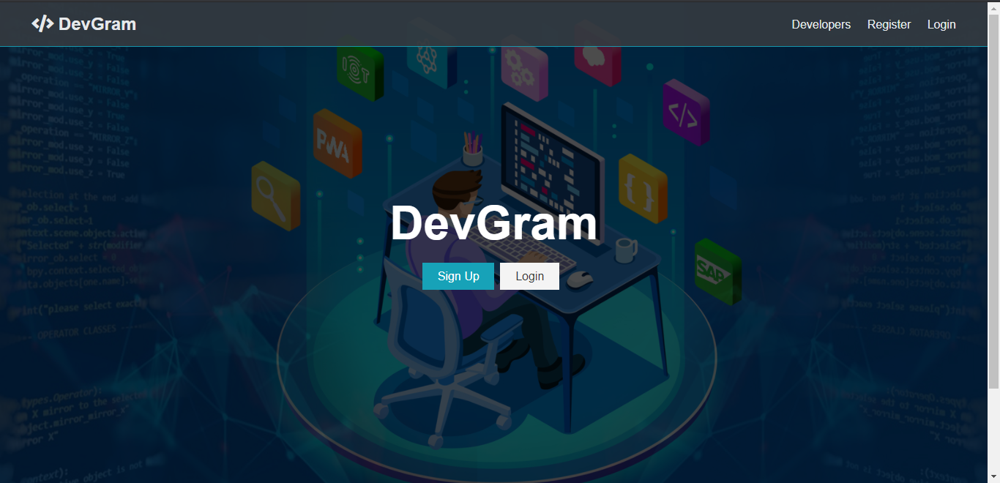
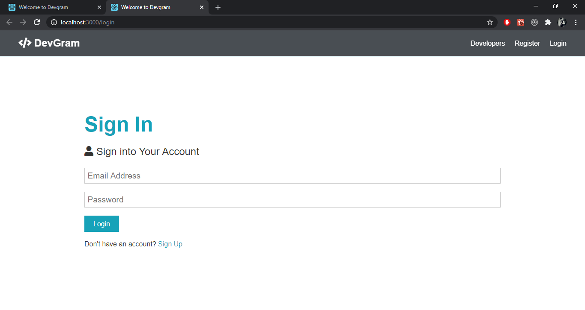
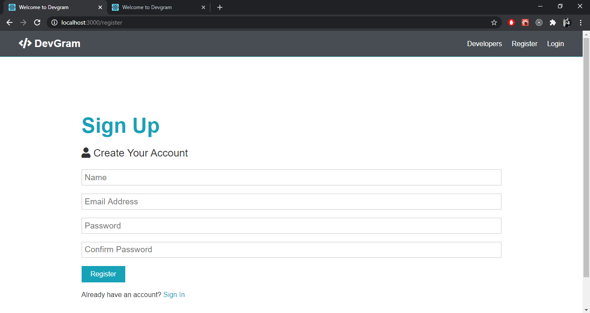

# Devgram
The aim of this project is to develop a social media platform targetted towards developers.
I have used Node.js for the backend and MongoDB as the database.The front-end is developed using React and Redux.

## Screenshots

